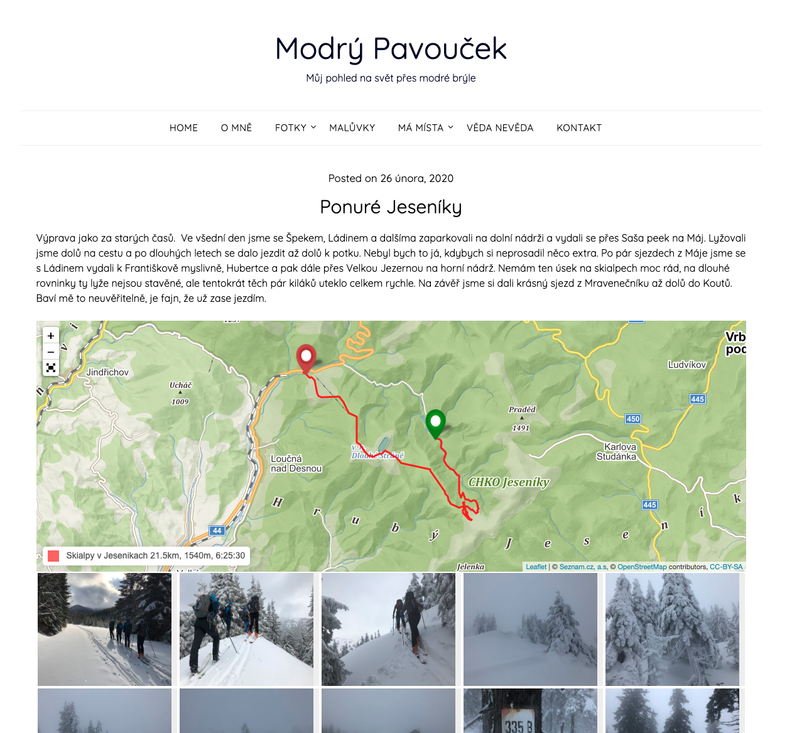

# BSMaps

BSMaps is a WordPress plugin. It provides new shortcode `bsmap` which renders
map and automatically adds all tracks found in attachments (media) of current
post. The implementation is based on excelent [Leaflet](https://leafletjs.com/)
javascript library. Current implementation suppor only single type of level -
tourist map from [mapy.cz](https://mapy.cz).

## Demo

See screenshot as well as my personal [blog
post](http://blue.pavoucek.cz/2020-ponure-jeseniky/) with rendered map.




## Installation

Plugin is not registered in WordPress plugin repository so it is not possible
to find it in plugin search section. You can install it by downloading zip file
from github and manually uploading via WP admin interface: `Plugins -> Add New
-> Upload Plugin`

## Development

It easy to setup development environment based on docker images.  Attached
`docker-compose.yml` allows to start containers for both wp and mysql database
with plugin mounted inside wp container. Start containers by invoking:
```
docker-compose up -d
```
Web server hosting clean WP installation should listen on `http://localhost:8080`
Editing code of the plugin is immediately visible in WP. You can visit running
container:
```
docker-compose exec wordpress bash
```
or
```
docker-compose exec mysql bash
```
To stop all containers:
```
docker-compose down
```
